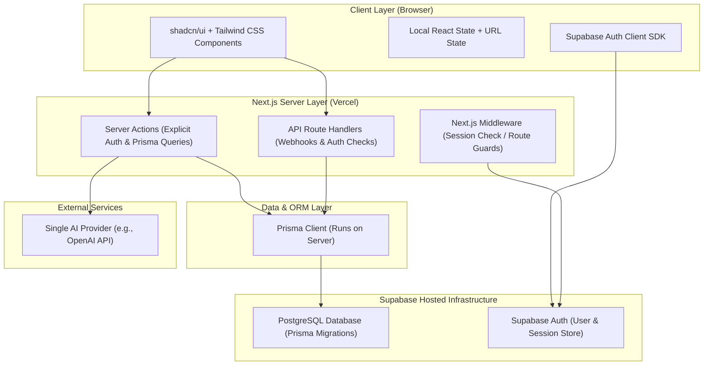

# System Architecture — ForgeFlow

This document defines the high-level architecture, division of responsibilities, directory structure, and integration pathways for ForgeFlow. It has been simplified to emphasize beginner-friendly concepts, explicit authorization, and a modular monolith approach.

---

## 1. High-Level Architectural Diagram



---

## 2. Layer Responsibilities (Beginner-Friendly & Technical)

### Frontend (Next.js Client Components)
- **Beginner-Friendly**: What you see on your screen. The pages, buttons, and forms. It only manages simple local page details (like whether a menu is open or what search query is in the URL).
- **Technical**: 
  - Render user interface elements utilizing **shadcn/ui** and **Tailwind CSS**.
  - No global state managers (like Redux or Zustand) or complex React Context will be introduced prematurely.
  - Data displays rely on **React Server Components (RSC)**. Page interactions use local React state (`useState`) and URL state (via query parameters).

### Server-Side (Next.js Server Actions & API Routes)
- **Beginner-Friendly**: The brain of the application. It runs on the server where users cannot see the database credentials or AI keys. It verifies *who* you are and *what* you are allowed to see before getting data.
- **Technical**:
  - **Server Actions**: Direct server-side asynchronous functions triggered from forms and client UI. They validate the session, run authorization checks, and invoke Prisma queries.
  - **Route Handlers**: Direct HTTP endpoints (`/api/...`) used for external webhooks.
  - **Next.js Middleware**: Runs before page requests to inspect session cookies. If a user is not logged in, they are redirected to `/login`.

### Database & ORM (PostgreSQL & Prisma)
- **Beginner-Friendly**: Prisma is a translator that lets us write TypeScript to talk to our database. PostgreSQL is the storage cabinet where all our project tables reside.
- **Technical**:
  - **Prisma**: The primary database access layer and migration manager. It acts as our single source of truth for the database schema.
  - **PostgreSQL**: Hosted on Supabase. Row-Level Security (RLS) is disabled or kept to simple defaults during initial development to avoid complex JWT propagation. Application-level explicit checks are used primarily.

---

## 3. Authentication & Authorization Flow

### The Difference
- **Authentication (AuthN)**: "Who are you?" (Handled by Supabase Auth).
- **Authorization (AuthZ)**: "Do you own this project or task?" (Handled by Next.js Server-Side Code).

### Step-by-Step Security Flow
1. **User Login**: The user signs in via Supabase Auth in the browser. Supabase issues an encrypted session cookie.
2. **Action Triggered**: The user clicks "Delete Project". A Server Action is invoked.
3. **Session Check**: The Server Action calls the Supabase Server SDK to retrieve the authenticated user:
   ```typescript
   const { data: { user } } = await supabase.auth.getUser();
   if (!user) throw new Error("Unauthenticated");
   ```
4. **Explicit Ownership Query**: Rather than relying on automatic database policies (RLS), the server explicitly queries Prisma, matching the user's ID against the project owner:
   ```typescript
   const project = await prisma.project.findUnique({
     where: { id: projectId }
   });
   
   if (!project || project.ownerId !== user.id) {
     throw new Error("Unauthorized access to project data");
   }
   ```
5. **Database Mutation**: If authorized, Prisma executes the delete statement.

---

## 4. Simplified AI Integration
- **Flow**:
  `UI Component` ➔ `Server Action` ➔ `AI Service Wrapper` ➔ `One configured Provider (OpenAI API)`
- **Security**: The AI API key is stored strictly on the server in `.env.local`. Client code has no direct access to it.
- **Abstraction**: A simple wrapper class/function handles generating text so we can easily swap the provider in the environment variables later without changing the UI code.

---

## 5. Deferring Containerization (Docker)
- **Decision**: Docker is not used during the first 11 development phases to prevent environment configuration overhead.
- **Local Dev Stack**: Next.js (npm local runtime) + Local or Supabase Hosted PostgreSQL + Prisma client. Docker will be introduced in Phase 12 for deployment packaging and production hardening.
