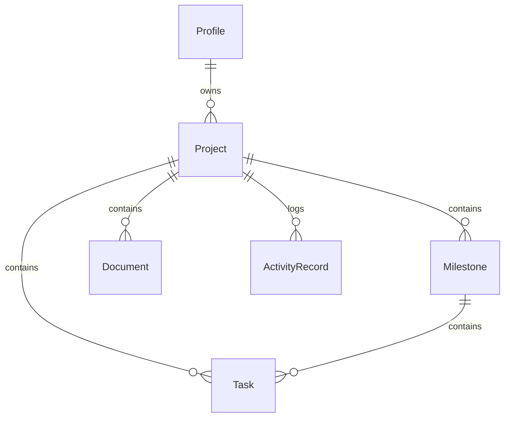

# Database Plan — ForgeFlow

This document outlines the database design, entity models, relationships, and the explicit ownership checks that ensure tenant data isolation.

---

## 1. Tenant Data Isolation via Explicit Server-Side Authorization

Instead of using a complex database-level Row-Level Security (RLS) policies propagation configuration, ForgeFlow enforces tenant isolation strictly and explicitly in Next.js Server-Side Code before any query runs.

### Rules of Access
1. **User Identity**: The user's ID is retrieved securely on the server from the Supabase Session.
2. **Explicit Verification**: The server performs an explicit database query check using Prisma.
3. **Example Ownership Check**:
   ```typescript
   // Check if a task is owned by the current user
   const task = await prisma.task.findUnique({
     where: { id: taskId },
     include: { project: true }
   });
   
   if (!task || task.project.ownerId !== currentUserId) {
     throw new Error("Unauthorized access to this resource.");
   }
   ```

---

## 2. Conceptual Entity Relationship Model



---

## 3. Entity Schemas & Fields

All mutable models contain consistent `createdAt` and `updatedAt` fields.

### Profile (User details matched to Supabase Auth)
- `id`: `UUID` (Primary Key, matching Supabase `auth.users.id`)
- `email`: `VARCHAR` (Unique)
- `fullName`: `VARCHAR`
- `createdAt`: `TIMESTAMP`
- `updatedAt`: `TIMESTAMP`

### Project
- `id`: `UUID` (Primary Key)
- `name`: `VARCHAR`
- `description`: `TEXT` (Nullable)
- `ownerId`: `UUID` (Foreign Key -> Profile.id, Cascade Delete)
- `createdAt`: `TIMESTAMP`
- `updatedAt`: `TIMESTAMP`
- *Index*: `ownerId`

### Milestone
- `id`: `UUID` (Primary Key)
- `projectId`: `UUID` (Foreign Key -> Project.id, Cascade Delete)
- `title`: `VARCHAR`
- `description`: `TEXT` (Nullable)
- `dueDate`: `TIMESTAMP` (Nullable)
- `createdAt`: `TIMESTAMP`
- `updatedAt`: `TIMESTAMP`
- *Index*: `projectId`

### Task (Kanban Cards)
- `id`: `UUID` (Primary Key)
- `projectId`: `UUID` (Foreign Key -> Project.id, Cascade Delete)
- `milestoneId`: `UUID` (Foreign Key -> Milestone.id, Nullable, Cascade Delete)
- `title`: `VARCHAR`
- `description`: `TEXT` (Nullable)
- `status`: `VARCHAR` (e.g., "TODO", "IN_PROGRESS", "DONE")
- `priority`: `VARCHAR` (e.g., "LOW", "MEDIUM", "HIGH")
- `position`: `DOUBLE PRECISION` (For ordering Kanban cards)
- `dueDate`: `TIMESTAMP` (Nullable)
- `createdAt`: `TIMESTAMP`
- `updatedAt`: `TIMESTAMP`
- *Indexes*: `projectId`, composite index `(projectId, status)`

### Document (Wikis)
- `id`: `UUID` (Primary Key)
- `projectId`: `UUID` (Foreign Key -> Project.id, Cascade Delete)
- `title`: `VARCHAR`
- `content`: `TEXT` (Markdown string)
- `createdAt`: `TIMESTAMP`
- `updatedAt`: `TIMESTAMP`
- *Index*: `projectId`

### ActivityRecord (Audits)
- `id`: `UUID` (Primary Key)
- `projectId`: `UUID` (Foreign Key -> Project.id, Cascade Delete)
- `userId`: `UUID` (Foreign Key -> Profile.id, Nullable)
- `action`: `VARCHAR` (e.g., "PROJECT_CREATED", "TASK_STATUS_CHANGED", "DOCUMENT_UPDATED")
- `details`: `VARCHAR` (Simple description of the change)
- `createdAt`: `TIMESTAMP`
- *Index*: `projectId`

---

## 4. Reordering Kanban Tasks using `position`

To support dragging and dropping tasks within a list without re-indexing the positions of all tasks, we use floating-point numbers (`DOUBLE PRECISION`):

1. **First Task**: Assigned a default position value (e.g., `65536`).
2. **Moving between Tasks**: When Task B is dragged between Task A and Task C, Task B's position is updated to the average of Task A and Task C's positions:
   $$\text{New Position} = \frac{\text{Position}_A + \text{Position}_C}{2}$$
3. **Moving to First/Last**:
   - If moved to the top: $\text{New Position} = \frac{\text{Position}_{\text{first}}}{2}$
   - If moved to the bottom: $\text{New Position} = \text{Position}_{\text{last}} + 65536$
4. **Benefit**: Avoids rewriting database indices for other tasks, resulting in high performance and simple SQL queries.
